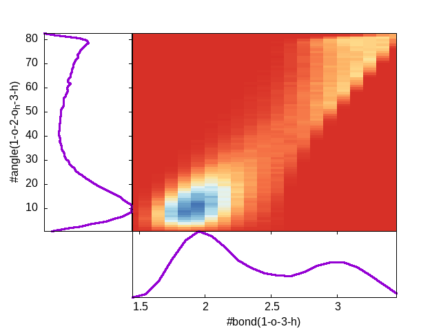

.. _Utilities:

Utilities
=========

Utilities are located in the ``utils`` directory of the source tree.

ardfgnufiles.sh
---------------

Create nice plots from the 8 output files by the :ref:`AngleRDF <Input>` command with gnuplot. Example:

The above image was generated as follows:

* Run through the :ref:`angular distribution function example <Examples>`, 
* This gets you 8 files called ``ardf.txt_1``, ``ardf.txt_2``, etc.
* Run ``ardfgnufiles.sh ardf.txt``
* This gets you 4 output files ending in ``.gnu``. 
* Run for example ``gnuplot -persist ardf.txt_r13_a.gnu``

blocklionanalysis.sh
-------------------------

Perform block-averaging over a trajectory. See the :ref:`Block averages example <Examples>`.

vim
------------------

``utils/vim`` contains some files to give you syntax highlighting of the input file, if you use the vim editor to write them.

It covers almost all input commands and options.

